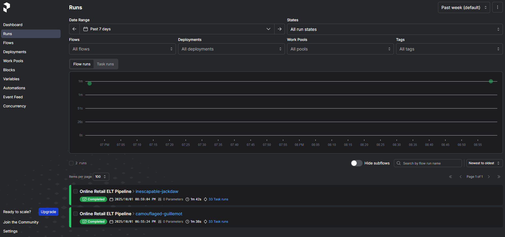
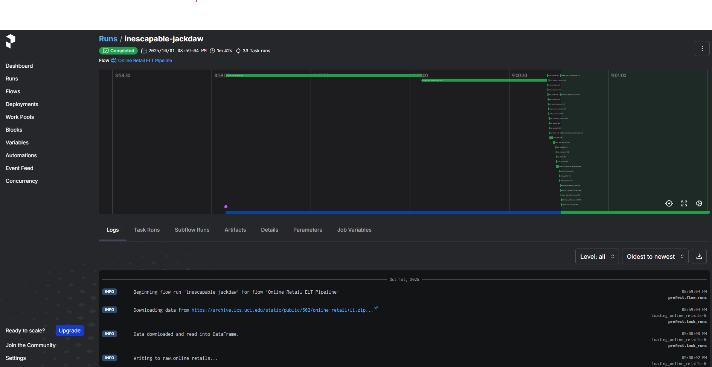

# 📊 interview-pipeline：使用 Prefect 編排的資料管線

## 📝 專案簡介

此專案旨在展示如何使用 **Python** 建立資料處理管線（Data Pipeline），並利用現代工作流協調工具 **Prefect** 進行任務（Tasks）和流程（Flows）的定義與編排。

## ✨ 主要特色

* **資料管線編排 (Orchestration):** 使用 **Prefect** 定義具備依賴關係的任務和流程，實現彈性且可觀測的資料工作流。
* **Python 開發:** 所有任務和流程均使用 Python 撰寫。
* **依賴管理 (Dependency Management):** 採用 **Poetry** 進行專案依賴管理，確保環境一致性。
* **持續整合/部署 (CI/CD):** 包含 GitHub Actions 設定，用於自動化測試或部署 Prefect 流程（`.github/workflows`）。
* **模組化設計:** 將核心業務邏輯與工具函數分層，提高程式碼的可讀性和可維護性。

## 🛠️ 技術棧 (Tech Stack)

| 類別 | 工具/語言 | 用途 |
| :--- | :--- | :--- |
| **主要語言** | Python | 核心開發語言 |
| **工作流編排** | Prefect | 任務和流程的定義、排程與監控 |
| **依賴管理** | Poetry | 專案依賴管理與虛擬環境建立 |
| **容器化** | Dockerfile  | 流程打包與環境隔離 |
| **持續整合** | GitHub Actions | 自動化工作流 (CI/CD) |

## 📂 專案結構

本專案採用以下結構組織程式碼：

```
interview-pipeline/
├── .github/
│   └── workflows/   # GitHub Actions 工作流定義
├── online_retails/  # 處理特定資料來源 (線上零售資料) 的主要管線邏輯
│   ├── tasks        # Prefect 任務定義
│   └── flows.py     # Prefect 流程定義
├── utilx/           # 通用工具函數、輔助模組
├── pyproject.toml   # Poetry 專案設定檔
├── poetry.lock      # Poetry 鎖定依賴版本
└── README.md
```

## 🚀 環境設定與執行

### 1. 安裝 Poetry

請確保您的系統已安裝 [Poetry](https://python-poetry.org/docs/#installation) ，這是用來管理 Python 依賴的工具。

### 2. 安裝專案依賴

克隆專案並使用 Poetry 安裝所有必要的依賴：

```bash
# 1. 克隆專案
git clone [https://github.com/zhweiliu/interview-pipeline.git](https://github.com/zhweiliu/interview-pipeline.git)
cd interview-pipeline

# 2. 啟動 Poetry 虛擬環境
poetry env use python

# 3. 進入虛擬環境
poetry env activate
```

### 3. 設定 local infrastructure

和這個 repository 配合的 [interview-infrastructure](https://github.com/zhweiliu/interview-infrastructure) 已將所需的環境都整理好。這是一個透過 k3d cluster 模擬 kubernetes 環境的工具，並在 k3d cluster 下部署許多對應服務，如 : 
* **Prefect :** 資料管道平台 (Data Pipeline)，比 Airflow 更加輕量且容易上手
* **ClickHouse :** 適合 OLAP 應用的資料庫
* **Metabase :** 提供給 Data Analyst 使用的視覺化 BI 工具
* **Prometheus :** 收集特定數據指標(metrics)，通常與 Grafana 配合使用
* **Grafana :** 從 Prometheus 收集 metrics ，建立監控面板並可設定警示條件(Alert)與通知方式(Email or slack)
* **Postgresql :** 提供給 Metabase 和 Prefect 紀錄組態設定

### 4. 執行 ClickHouse 初始化 sql 

請先執行 ClickHouse 初始化 sql ，建置程式需要使用的 **Databases / Tables**

* 1. port-forward clickhouse
        ```base
        kubectl port-forward service/service-standard 8123:8123 -n database
        ```

* 2. 使用支援 ClickHouse 的 DB Tool 連線登入。推薦使用 [DBeaver](https://dbeaver.io/download/)
        ```
        # 使用 superuser 帳號密碼登入
        帳號 : admin
        密碼 : admin
        ```

* 3. 執行 `online_retails/ddl/init.sql` 檔案，並確認以下 database 建立完成
        ```
        - raw
        - vault
        - marts
        - quality
        ```

### 5. 本地端執行方法 (建議使用 VSCode)

#### 1. local infrastructure 設定完成後，在 VSCode 建立一個 **Python Debugger** ，並修改 **launch.json** 如下
```
{
    // Use IntelliSense to learn about possible attributes.
    // Hover to view descriptions of existing attributes.
    // For more information, visit: https://go.microsoft.com/fwlink/?linkid=830387
    "version": "0.2.0",
    "configurations": [

        {
            "name": "oneline_retails",
            "type": "debugpy",
            "request": "launch",
            "program": "${workspaceFolder}/online_retails/flow.py",
            "envFile": "${workspaceFolder}/online_retails/.env",
        }
    ]
}
```

#### 2. 修改 **online_retails/.env** 的 PYTHONPATH ， 指向到 workspace 的根目錄 (或是 online_retails 上一層)
```
# 目前 .env 是我個人開發環境的路徑，請修改以下內容以適配您的開發環境
PYTHONPATH="C:\\Users\\zweil\\Documents\\interview-pipeline"
```

#### 3. 執行 Debugger

### 5.1 本地端執行方法 (使用 Kubectl)

若您熟悉 kubernetes 與 kubectl 的操作，您可以直接執行 [interview-infrastructure](https://github.com/zhweiliu/interview-infrastructure) 已經幫您建置好的 Cronjob `online-retail-flow`

#### 1. 檢查 Cronjob `online-retail-flow` 是否部屬完成

```bash
kubectl get cronjob -n prefect

# NAME                 SCHEDULE    TIMEZONE   SUSPEND   ACTIVE   LAST SCHEDULE   AGE
online-retail-flow   0 0 * * *   <none>     True      0        <none>          159m
```

#### 2. 建立 Job 執行

```bash
kubectl create job online-retail-flow --from=cronjob/online-retail-flow -n prefect
```

#### 3. 檢查 Pod 是否執行
``` bash
kubectl get pod -n prefect

# NAME                                          READY   STATUS    RESTARTS     AGE
> online-retail-flow-692k5                      1/1     Running   0            4s
prefect-server-ddd78c8bf-j2hxq                1/1     Running   5 (8h ago)   3d19h
prometheus-prefect-exporter-7778c866b-f2zlq   1/1     Running   3 (8h ago)   19h
```

主要確認 `prefect-server-` 開頭的 pod 是否進入 Running status ，該 pod 後綴為隨機碼

#### 4. port-forward prefect-server

```bash
kubectl port-forward service/prefect-server 4200:4200 -n prefect
```

利用 URL 登入 prefect UI -> 左側選單點擊 Runs

您應該會看到一個正在執行的 flow `Online Retail ELT Pipeline` (下圖是 flow 執行完畢後我才截圖)



點擊 flow 的隨機碼，可以看到 flow 執行的細節



#### 5. 進入 metabase 查看 dashboard

先執行 port-forward metabase service

```bash
kubectl port-forward service/metabase 8300:8300 -n database
```

透過 URL 進入到 metabase UI 查看 dashboard 。


